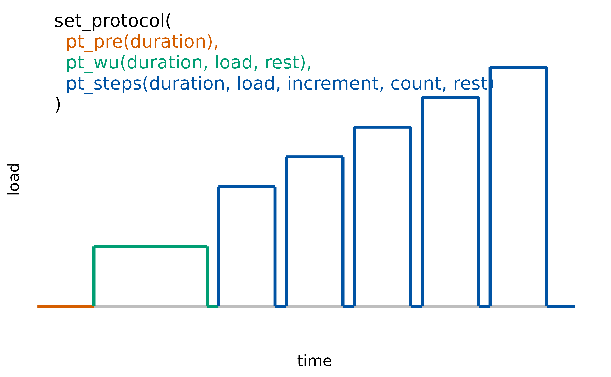

# Import & Processing

Different measuring devices and analysis software lead to opaque results
in measuring gas exchange parameters. To make exercise science more
transparent and reproducible, the `spiro` package offers a standardized
workflow for data from cardiopulmonary exercise testing.

This vignette provides information on how the `spiro` package imports
and processes raw data from metabolic carts.

## Import and processing with `spiro()`

The `spiro` package makes import and processing of cardiopulmonary data
easy: The
[`spiro()`](https://docs.ropensci.org/spiro/reference/spiro.md) function
does all that work for you. You just need to paste the path of a file
with raw data from cardiopulmonary exercise testing to the function.
This will return a `data.frame` containing all relevant data for each
second of testing, ready for [summarizing or
plotting](https://docs.ropensci.org/spiro/articles/summarizing_plotting.html).

``` r

library(spiro)

# Get example data
file <- spiro_example("zan_gxt")

spiro(file)
#>    load step time    VO2   VCO2    RR   VT    VE HR PetO2 PetCO2 VO2_rel
#> 1     0    0    1     NA     NA    NA   NA    NA NA    NA     NA      NA
#> 2     0    0    2     NA     NA    NA   NA    NA NA    NA     NA      NA
#> 3     0    0    3     NA     NA    NA   NA    NA NA    NA     NA      NA
#> 4     0    0    4 399.08 323.70 13.94 0.77 10.72 NA    NA     NA    6.05
#> 5     0    0    5 409.83 330.26 14.50 0.74 10.66 NA    NA     NA    6.21
#> 6     0    0    6 420.58 336.82 15.06 0.71 10.60 NA    NA     NA    6.37
#> 7     0    0    7 431.33 343.37 15.63 0.68 10.53 NA    NA     NA    6.54
#> 8     0    0    8 435.30 346.51 16.06 0.69 11.04 NA    NA     NA    6.60
#> 9     0    0    9 437.02 348.52 16.46 0.71 11.74 NA    NA     NA    6.62
#> 10    0    0   10 438.74 350.53 16.85 0.74 12.44 NA    NA     NA    6.65
#>    VCO2_rel RE  RER  CHO   FO
#> 1        NA NA   NA   NA   NA
#> 2        NA NA   NA   NA   NA
#> 3        NA NA   NA   NA   NA
#> 4      4.90 NA 0.81 0.20 0.13
#> 5      5.00 NA 0.81 0.19 0.13
#> 6      5.10 NA 0.80 0.19 0.14
#> 7      5.20 NA 0.80 0.18 0.15
#> 8      5.25 NA 0.80 0.18 0.15
#> 9      5.28 NA 0.80 0.19 0.15
#> 10     5.31 NA 0.80 0.19 0.15
#> ... with 2999 more rows
```

[`spiro()`](https://docs.ropensci.org/spiro/reference/spiro.md) will
return interpolated data for the following parameters:

- **load**: velocity or power, either retrieved from the raw data file
  or manually supplied by [setting a protocol](#protocol-set)
- **step**: coded variable for the number of the load step in the test
  protocol
- **time**: time (s)
- **VO2**: oxygen uptake (ml/min)
- **VCO2**: carbon dioxide output (ml/min)
- **RR**: respiratory rate (1/min)
- **VT**: tidal volume (l)
- **VE**: minute ventilation (l/min)
- **HR**: heart rate (bpm), if available
- **PetO2**: end-tidal partial pressure of oxygen (mmHg)
- **PetCO2**: end-tidal partial pressure of carbon dioxide (mmHg)
- **VO2_rel**: relative oxygen uptake (ml/min/kg)
- **VCO2_rel**: relative carbon dioxide output (ml/min/kg)
- **RE**: running economy (ml/kg/km), if applicable
- **RER**: respiratory quotient
- **CHO**: rate of carbohydrate oxidation (g/min)
- **FO**: rate of fat oxidation (g/min)

### Options for data processing

You can control the exercise protocol, the calculation of parameters
related to body weight and the adding of heart rate data with the
arguments of
[`spiro()`](https://docs.ropensci.org/spiro/reference/spiro.md) or with
the helper functions
[`add_protocol()`](https://docs.ropensci.org/spiro/reference/add_protocol.md),
`add_weight()` and
[`add_hr()`](https://docs.ropensci.org/spiro/reference/add_hr.md) within
a piping syntax:

``` r

# Note: The Base R pipe requires R version 4.1 or greater

protocol <- set_protocol(
  pt_wu(duration = 120, load = 50),
  pt_steps(duration = 30, load = 100, increment = 20, count = 24)
)

spiro(file = spiro_example("zan_ramp")) |>
  add_bodymass(bodymass = 63.4) |>
  add_protocol(protocol) |>
  add_hr(hr_file = spiro_example("hr_ramp.tcx"), hr_offset = 0)
```

### Use breath-by-breath data!

We highly recommended to import only raw breath-by-breath data for
several reasons:

- Prior averaging or interpolation happens outside of R and is therefore
  a non-reproducible data processing step.
- If no data for single breaths is available, some functionality of the
  package is lost (e.g. breath-based averaging for VO_2max\_
  determination).
- Prior processing usually leads to data containing less data points,
  which hinders the automated guessing of exercise protocols based on
  the available load data.

If you use a metabolic cart that measures, but does not output data on a
breath-by-breath basis, read the manufacturer’s instructions on how to
export the raw data in such a way. Data from other systems (e.g., most
mixing chamber metabolic carts) can still be processed with the
`spiro`-package, but protocol guesses and summary calculations have to
be treated with caution.

## Supported metabolic carts

The `spiro` package supports different metabolic carts. The metabolic
cart a data file is produced by is usually determined automatically, but
can also be set manually in the
[`spiro()`](https://docs.ropensci.org/spiro/reference/spiro.md)
function. Currently this package supports the following devices:

- **CORTEX** (`"cortex"`): .xlsx, .xls or .xml files in English or
  German language
- **COSMED** (`"cosmed"`): .xlsx or .xls files in English or German
  language
- **VYNTUS** (`"vyntus"`): .txt files (tab-separated) in English,
  French, German or Norwegian language
- **ZAN** (`"zan"`): .dat files, usually with the name “EXED\*” in
  German language

To only import the raw data without further processing (such as
interpolation, exercise protocol guessing,…) use the function
[`spiro_raw()`](https://docs.ropensci.org/spiro/reference/spiro_raw.md):

``` r

spiro_raw(file, device = NULL, anonymize = TRUE)
#>     time VO2 VCO2    RR   VT    VE HR load PetO2 PetCO2
#> 1   3.44 393  320 13.62 0.79 10.76 NA    0    NA     NA
#> 2   7.25 434  345 15.76 0.67 10.51 NA    0    NA     NA
#> 3  10.73 440  352 17.14 0.76 12.96 NA    0    NA     NA
#> 4  13.97 582  451 18.63 0.65 12.13 NA    0    NA     NA
#> 5  17.20 837  677 18.47 1.07 19.71 NA    0    NA     NA
#> 6  20.39 902  753 18.87 1.19 22.42 NA    0    NA     NA
#> 7  24.37 391  338 15.08 1.01 15.23 NA    0    NA     NA
#> 8  28.00 503  428 16.52 0.69 11.45 NA    0    NA     NA
#> 9  32.06 246  214 14.78 0.61  8.97 NA    0    NA     NA
#> 10 34.65 728  605 23.25 0.54 12.46 NA    0    NA     NA
#> ... with 1987 more rows
```

Alternatively you can also access the raw data after a
[`spiro()`](https://docs.ropensci.org/spiro/reference/spiro.md) call.

``` r

s <- spiro(file)
spiro_raw(s)
```

## Exercise protocols

To achieve the full functionality of data summary and plotting with the
`spiro` package, an exercise protocol needs to be attached to the data.

### Protocol guessing

By default,
[`spiro()`](https://docs.ropensci.org/spiro/reference/spiro.md) guesses
the exercise protocol using
[`get_protocol()`](https://docs.ropensci.org/spiro/reference/get_protocol.md),
looking for velocity or load data in the imported raw data. To return
the protocol guess after a
[`spiro()`](https://docs.ropensci.org/spiro/reference/spiro.md) call,
access the `"protocol"` attribute.

``` r

s <- spiro(file)
attr(s, "protocol")
#>    duration load         type code
#> 1        60  0.0 pre measures    0
#> 2       300  2.0         load    1
#> 3        30  0.0         rest   -1
#> 4       300  2.4         load    2
#> 5        30  0.0         rest   -1
#> 6       300  2.8         load    3
#> 7        30  0.0         rest   -1
#> 8       300  3.2         load    4
#> 9        30  0.0         rest   -1
#> 10      300  3.6         load    5
#> 11       30  0.0         rest   -1
#> 12      300  4.0         load    6
#> 13       30  0.0         rest   -1
#> 14      300  4.4         load    7
#> 15       30  0.0         rest   -1
#> 16      300  4.8         load    8
#> 17       30  0.0         rest   -1
#> 18      300  5.2         load    9
#> 19       10  0.0         rest   -1
```

### Protocol setting

In cases where no load data is saved in the metabolic cart’s file or
[`get_protocol()`](https://docs.ropensci.org/spiro/reference/get_protocol.md)
turns wrong, a protocol can be manually set.

There are two ways to initially generate a protocol: by providing all
load-duration combinations with
[`set_protocol_manual()`](https://docs.ropensci.org/spiro/reference/set_protocol_manual.md)
or by using the helper functions within
[`set_protocol()`](https://docs.ropensci.org/spiro/reference/set_protocol.md).
Once a protocol has been set, it can be used as the `protocol` argument
in a [`spiro()`](https://docs.ropensci.org/spiro/reference/spiro.md)
call or attached to a `spiro` data frame with
[`add_protocol()`](https://docs.ropensci.org/spiro/reference/add_protocol.md).

``` r

# manually setting a test protocol
pt <- set_protocol_manual(
  duration = c(60, 300, 30, 300, 30, 300, 30, 300, 30, 300, 30, 300, 30, 300, 30, 300, 30, 300),
  load = c(0, 3, 0, 3.2, 0, 3.4, 0, 3.6, 0, 3.8, 0, 4, 0, 4.2, 0, 4.4, 0, 4.6)
)

# attach protocol within spiro call
s <- spiro(file, protocol = pt)

# attach protocol with `add_protocol`
t <- spiro(file)
add_protocol(t, pt)
#>    load step time    VO2   VCO2    RR   VT    VE HR PetO2 PetCO2 VO2_rel
#> 1     0    0    1     NA     NA    NA   NA    NA NA    NA     NA      NA
#> 2     0    0    2     NA     NA    NA   NA    NA NA    NA     NA      NA
#> 3     0    0    3     NA     NA    NA   NA    NA NA    NA     NA      NA
#> 4     0    0    4 399.08 323.70 13.94 0.77 10.72 NA    NA     NA    6.05
#> 5     0    0    5 409.83 330.26 14.50 0.74 10.66 NA    NA     NA    6.21
#> 6     0    0    6 420.58 336.82 15.06 0.71 10.60 NA    NA     NA    6.37
#> 7     0    0    7 431.33 343.37 15.63 0.68 10.53 NA    NA     NA    6.54
#> 8     0    0    8 435.30 346.51 16.06 0.69 11.04 NA    NA     NA    6.60
#> 9     0    0    9 437.02 348.52 16.46 0.71 11.74 NA    NA     NA    6.62
#> 10    0    0   10 438.74 350.53 16.85 0.74 12.44 NA    NA     NA    6.65
#>    VCO2_rel RE  RER  CHO   FO
#> 1        NA NA   NA   NA   NA
#> 2        NA NA   NA   NA   NA
#> 3        NA NA   NA   NA   NA
#> 4      4.90 NA 0.81 0.20 0.13
#> 5      5.00 NA 0.81 0.19 0.13
#> 6      5.10 NA 0.80 0.19 0.14
#> 7      5.20 NA 0.80 0.18 0.15
#> 8      5.25 NA 0.80 0.18 0.15
#> 9      5.28 NA 0.80 0.19 0.15
#> 10     5.31 NA 0.80 0.19 0.15
#> ... with 2999 more rows
```

With
[`set_protocol()`](https://docs.ropensci.org/spiro/reference/set_protocol.md)
a protocol can be defined without specifying every single load step. You
can paste the pre-defined segment types
[`pt_pre()`](https://docs.ropensci.org/spiro/reference/set_protocol.md),
[`pt_wu()`](https://docs.ropensci.org/spiro/reference/set_protocol.md),
[`pt_const()`](https://docs.ropensci.org/spiro/reference/set_protocol.md)
and
[`pt_steps()`](https://docs.ropensci.org/spiro/reference/set_protocol.md)
into
[`set_protocol()`](https://docs.ropensci.org/spiro/reference/set_protocol.md)
in the desired order. The following graph illustrates an example of this
practice:



``` r

set_protocol(pt_pre(60), pt_wu(300, 80), pt_steps(180, 100, 25, 6, 30))
#>    duration load
#> 1        60    0
#> 2       300   80
#> 3       180  100
#> 4        30    0
#> 5       180  125
#> 6        30    0
#> 7       180  150
#> 8        30    0
#> 9       180  175
#> 10       30    0
#> 11      180  200
#> 12       30    0
#> 13      180  225
```

## Modify body mass

The `spiro` package calculates parameters relative to body mass. Per
default [`spiro()`](https://docs.ropensci.org/spiro/reference/spiro.md)
will look for information on body mass in the meta data of the original
data file. If for some reason no or the wrong body mass is present in
the raw data file, `bodymass` can be manually given as an argument in
[`spiro()`](https://docs.ropensci.org/spiro/reference/spiro.md) or with
[`add_bodymass()`](https://docs.ropensci.org/spiro/reference/add_bodymass.md).

``` r

# set body mass as an argument in `spiro()`
s <- spiro(file, bodymass = 68.3)

# set body mass using `add_weight()`
t <- spiro(file)
u <- add_bodymass(t, 68.3)
```

## Work with external heart rate data

Some metabolic carts only offer complicated options for connecting them
to heart rate monitors. If heart rate data was recorded by another kind
of device (e.g. wrist watch), this data can be added within the
[`spiro()`](https://docs.ropensci.org/spiro/reference/spiro.md) call or
by using
[`add_hr()`](https://docs.ropensci.org/spiro/reference/add_hr.md).

``` r

# get example data file path
hpath <- spiro_example("hr_ramp.tcx")

# add heart rate data within `spiro()`
h <- spiro(file, hr_file = hpath, hr_offset = 0)

# add heart rate data with `add_hr()`
i <- spiro(file)
j <- add_hr(i, hr_file = hpath, hr_offset = 0)
```

[`add_hr()`](https://docs.ropensci.org/spiro/reference/add_hr.md) will
import the heart rate data from a .tcx file and attach it to the
existing data set. You can manually set the starting point of the heart
rate recording relative to the start of the gas exchange measures
recording with the `hr_offset` argument.
