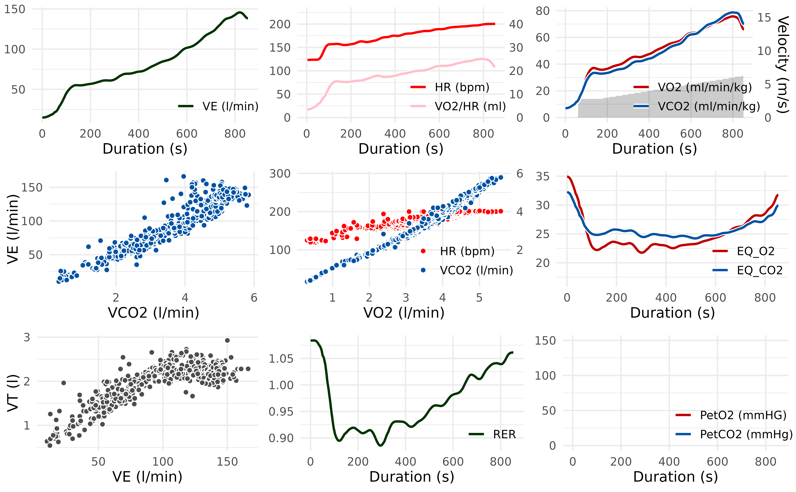
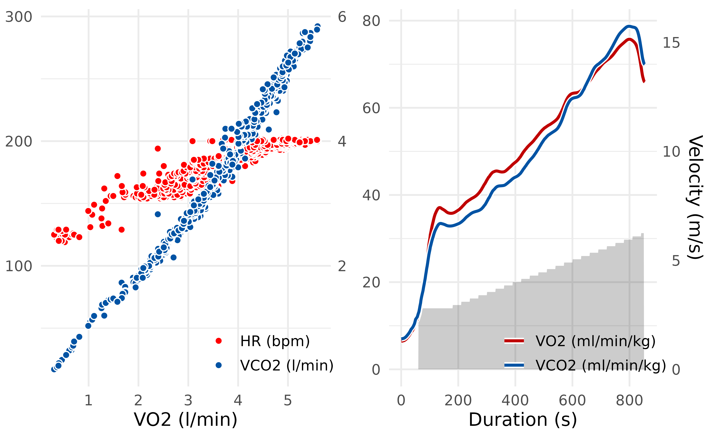
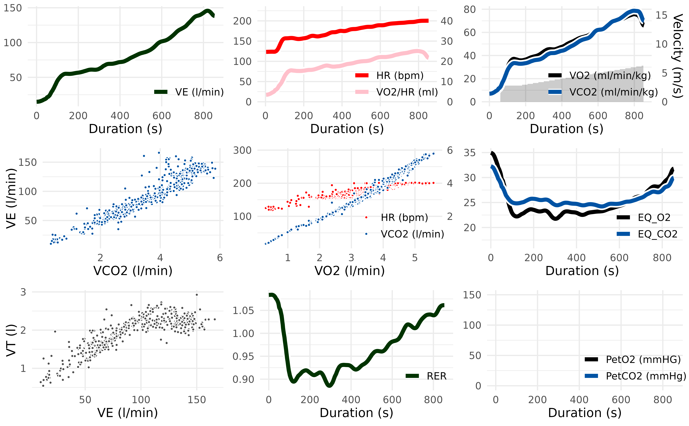
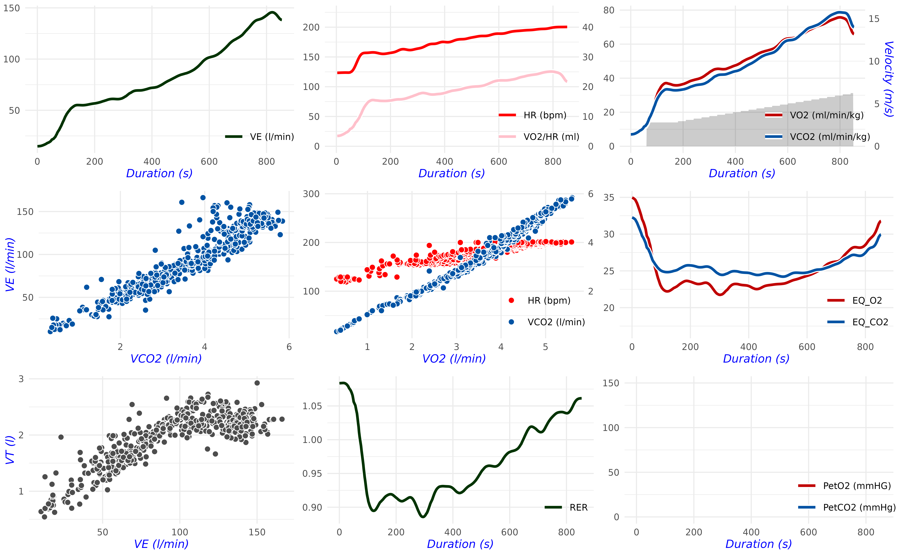

# Summarizing & Plotting

Different measuring devices and analysis software lead to opaque results
in measuring gas exchange parameters. To make exercise science more
transparent and reproducible, the `spiro` package offers a standardized
workflow for data from metabolic carts.

This vignette provides you information on how to summarize and plot data
[previously imported and
processed](https://docs.ropensci.org/spiro/articles/import_processing.html)
by [`spiro()`](https://docs.ropensci.org/spiro/reference/spiro.md).

#### Load the data

``` r

library(spiro)

# import and process example data
file <- spiro_example("zan_gxt")
gxt_data <- spiro(file)
gxt_data
#>    load step time    VO2   VCO2    RR   VT    VE HR PetO2 PetCO2 VO2_rel
#> 1     0    0    1     NA     NA    NA   NA    NA NA    NA     NA      NA
#> 2     0    0    2     NA     NA    NA   NA    NA NA    NA     NA      NA
#> 3     0    0    3     NA     NA    NA   NA    NA NA    NA     NA      NA
#> 4     0    0    4 399.08 323.70 13.94 0.77 10.72 NA    NA     NA    6.05
#> 5     0    0    5 409.83 330.26 14.50 0.74 10.66 NA    NA     NA    6.21
#> 6     0    0    6 420.58 336.82 15.06 0.71 10.60 NA    NA     NA    6.37
#> 7     0    0    7 431.33 343.37 15.63 0.68 10.53 NA    NA     NA    6.54
#> 8     0    0    8 435.30 346.51 16.06 0.69 11.04 NA    NA     NA    6.60
#> 9     0    0    9 437.02 348.52 16.46 0.71 11.74 NA    NA     NA    6.62
#> 10    0    0   10 438.74 350.53 16.85 0.74 12.44 NA    NA     NA    6.65
#>    VCO2_rel RE  RER  CHO   FO
#> 1        NA NA   NA   NA   NA
#> 2        NA NA   NA   NA   NA
#> 3        NA NA   NA   NA   NA
#> 4      4.90 NA 0.81 0.20 0.13
#> 5      5.00 NA 0.81 0.19 0.13
#> 6      5.10 NA 0.80 0.19 0.14
#> 7      5.20 NA 0.80 0.18 0.15
#> 8      5.25 NA 0.80 0.18 0.15
#> 9      5.28 NA 0.80 0.19 0.15
#> 10     5.31 NA 0.80 0.19 0.15
#> ... with 2999 more rows
```

## Stepwise summary with `spiro_summary()`

In the analysis of gas exchange data, often mean parameters for each
performed load step are of interest. To ensure the presence of a
metabolic steady state, the end of each step is used for calculations.

``` r

spiro_summary(gxt_data, interval = 120)
#> for pre-measures, interval was set to length of measures (60 seconds)
#>    step_number duration load     VO2    VCO2     VE HR PetO2 PetCO2 VO2_rel
#> 1            0       60  0.0  500.19  411.74  13.03 NA    NA     NA    7.58
#> 2            1      300  2.0 1860.92 1585.75  39.87 NA    NA     NA   28.20
#> 3            2      300  2.4 2097.82 1805.27  44.63 NA    NA     NA   31.79
#> 4            3      300  2.8 2413.01 2122.17  52.63 NA    NA     NA   36.56
#> 5            4      300  3.2 2710.68 2319.93  57.19 NA    NA     NA   41.07
#> 6            5      300  3.6 3048.75 2684.87  67.45 NA    NA     NA   46.19
#> 7            6      300  4.0 3404.02 3026.70  75.91 NA    NA     NA   51.58
#> 8            7      300  4.4 3724.37 3383.64  88.36 NA    NA     NA   56.43
#> 9            8      300  4.8 4223.82 3993.55 106.44 NA    NA     NA   64.00
#> 10           9      300  5.2 4573.91 4488.36 127.54 NA    NA     NA   69.30
#>        RE  RER  CHO   FO
#> 1      NA 0.82 0.27 0.15
#> 2  234.97 0.85 1.27 0.46
#> 3  220.73 0.86 1.51 0.49
#> 4  217.62 0.88 1.95 0.48
#> 5  213.91 0.86 1.89 0.65
#> 6  213.86 0.88 2.47 0.60
#> 7  214.90 0.89 2.90 0.62
#> 8  213.75 0.91 3.50 0.56
#> 9  222.21 0.95 4.68 0.37
#> 10 222.12 0.98 5.82 0.12
```

The length of the computational interval (in seconds) can be modified
with the `interval` argument. If the interval exceeds the length of any
step, it will be shortened for these steps displaying a note. You can
turn such messages off with setting the argument `quiet = TRUE`.

## Maximal parameter values with `spiro_max()`

For some types of exercise tests it may be preferable to get maximal
values of the measured parameters (e.g., the maximum oxygen uptake
VO_(2max)).
[`spiro_max()`](https://docs.ropensci.org/spiro/reference/spiro_max.md)
calculates these after smoothing the data.

``` r

spiro_max(gxt_data, smooth = 30)
#>       VO2    VCO2     VE VO2_rel  RER HR
#> 1 4732.28 4640.75 129.62    71.7 0.99 NA
```

The `smooth` argument controls the interval and method for the data
smoothing. Different smoothing methods are available: Moving averages
over fixed time intervals (e.g. `smooth = 30` for 30 seconds), moving
averages over a fixed number of breaths (e.g. `smooth = "30b"` for 30
breaths) or digital filters (e.g. `smooth = "0.04fz3"` for a third-order
zero-phase low-pass Butterworth filter with a cut-off frequency of 0.04
Hz). Per default the smoothing will not apply to the heart rate values,
but you can enable this behavior with `hr_smooth = TRUE`.

## Plotting the data

The `spiro` package lets you visualize data from cardiopulmonary
exercise testing: With
[`spiro_plot()`](https://docs.ropensci.org/spiro/reference/spiro_plot.md)
you can display the traditional Wasserman 9-Panel Plot.

``` r

# load example data
data <- spiro(spiro_example("zan_ramp"), hr_file = spiro_example("hr_ramp.tcx"))

spiro_plot(data)
```



You can individually select and combine panels of the 9-Panel Plot by
setting the `which` argument.

``` r

# Plot only V-Slope (Panel 5) and VO2/VCO2 over time (Panel 3)
spiro_plot(data, which = c(5, 3))
```



Data over time (Panel 1,2,3,6,8,9) will be displayed smoothed, as
determined via the `smooth` argument. The other panels (4,5,7) use the
raw breath-by-breath data for visualization.

You can control the appearance of the plots in
[`spiro_plot()`](https://docs.ropensci.org/spiro/reference/spiro_plot.md).
Use the `style_args` argument to control the size and color of points
and lines.

``` r

# Change size of points, width of lines and color of VO2 points/lines
spiro_plot(
  data,
  style_args = list(
    size = 1,
    linewidth = 2,
    color_VO2 = "black"
  )
)
```



Use the `base_size` argument to change the plot base size. You can pass
other style arguments to `ggplot::theme()` via the `style_args` argument
for further customization.

``` r

# Change base size and axis label font
spiro_plot(
  data,
  base_size = 9,
  style_args = list(
    axis.title = ggplot2::element_text(face = "italic", colour = "blue")
  )
)
```


